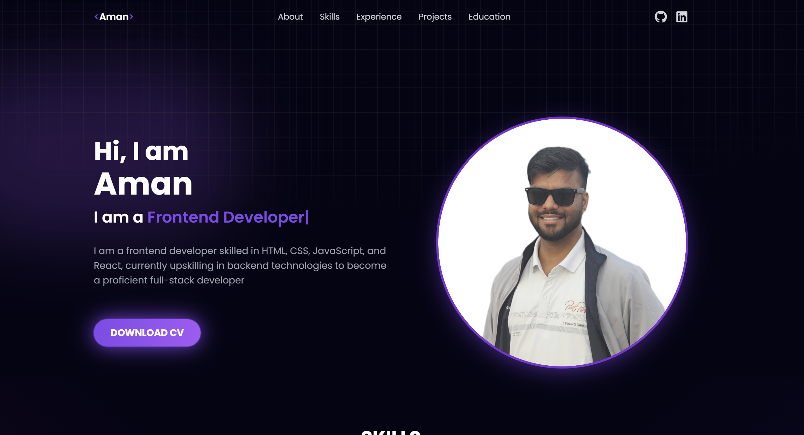
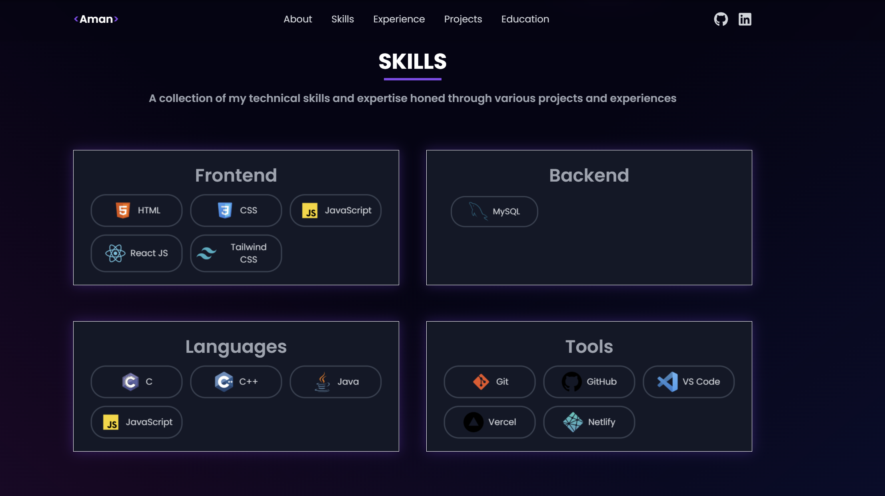
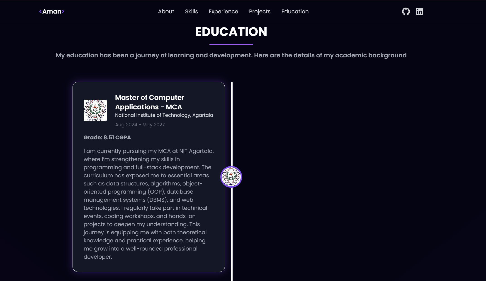
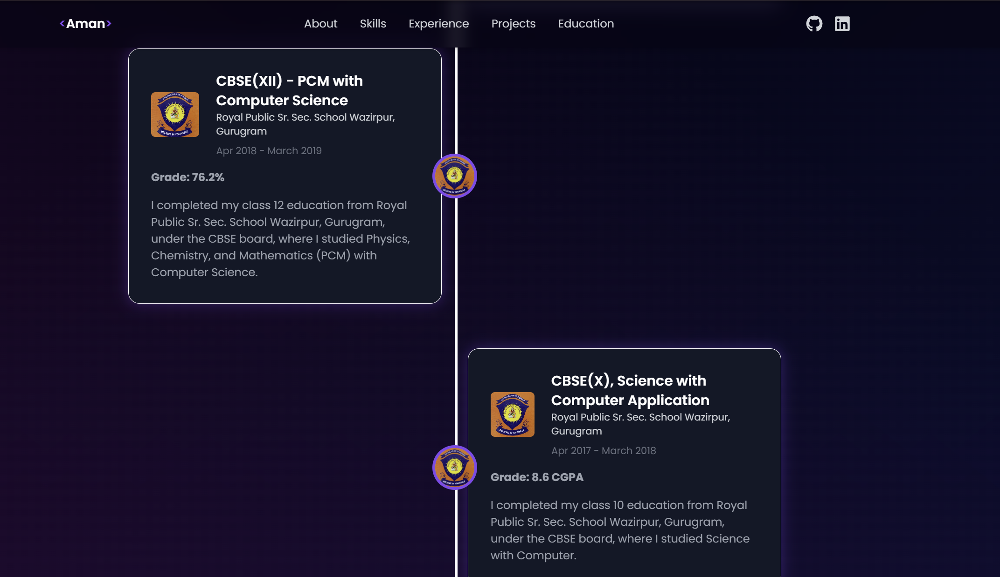
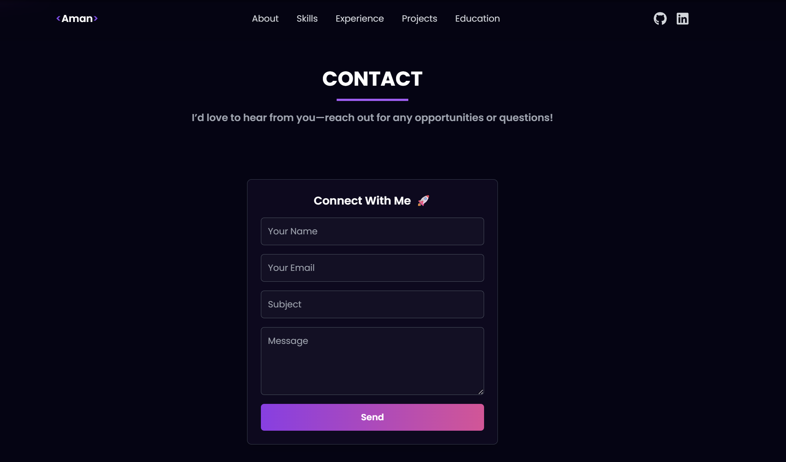

# 💼 Aman – Portfolio Website

A modern, responsive personal portfolio built using **React**, **Tailwind CSS**, and **EmailJS**, showcasing my projects, skills, education, and a fully functional contact form.

🌐 **Live Site:** [aman-portfolio-website1.vercel.app](https://aman-portfolio-website1.vercel.app/)

---

## 🖼️ Screenshots

### 🏠 Home + About Section


### 🛠️ Skills Section


### 🎓 Education Section (Part 1)


### 🎓 Education Section (Part 2)


### ✉️ Contact Form


---

## 🚀 Features

- ⚛️ Built with React + Vite
- 🎨 Styled using Tailwind CSS
- 📄 About, Skills, and Education sections
- 📬 Contact form powered by **EmailJS**
- 🌐 Social media integration

---

## 🛠️ Tech Stack

- **React** (via Vite)
- **Tailwind CSS**
- **EmailJS**
- **Vercel** for deployment

---

## ⚙️ Getting Started

```bash
git clone https://github.com/amanydv1106/MyPortfolio.git
cd MyPortfolio
npm install
npm run dev
