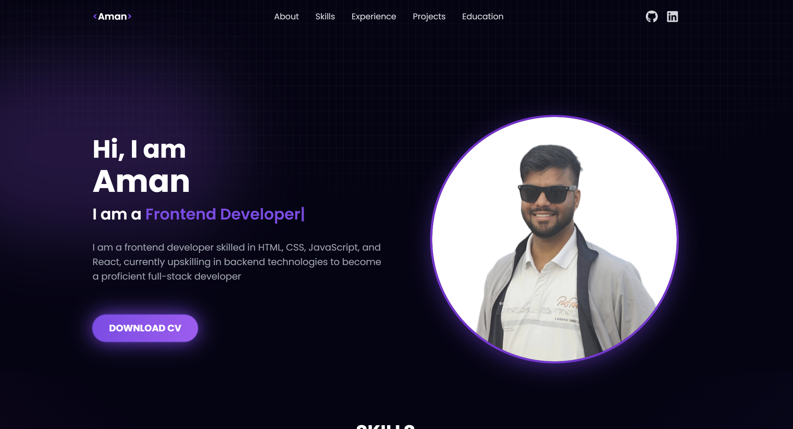
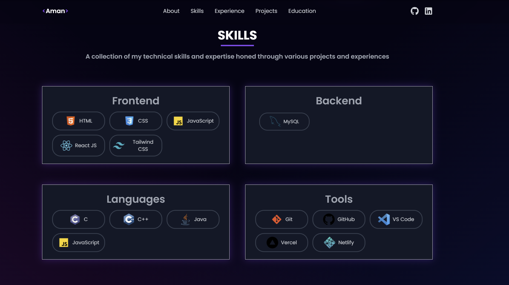
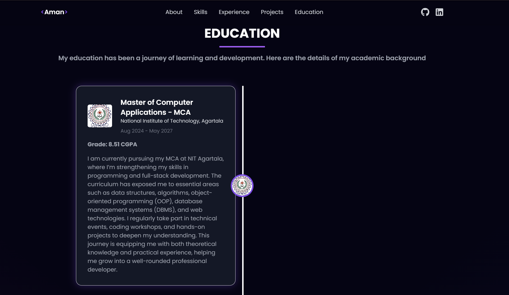
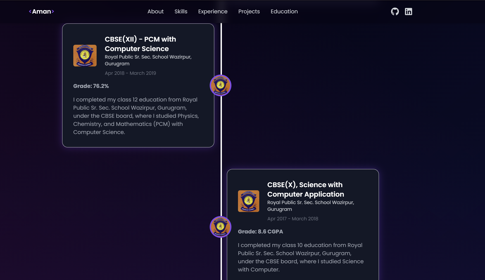
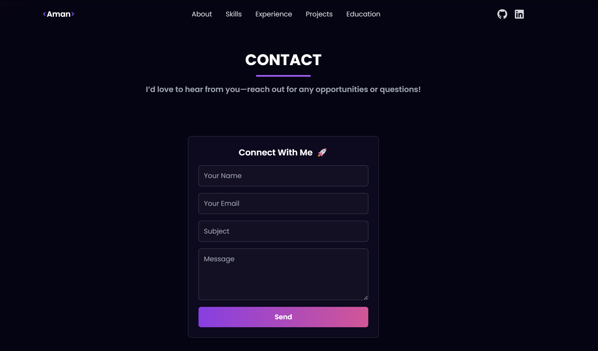

# Aman Portfolio

A modern portfolio website built with React, Vite, and Tailwind CSS to present professional experience, technical skills, projects, education, and contact information in a clean and responsive interface.

## Overview

This portfolio is designed to support personal branding, recruiter review, and production deployment. It highlights full stack development work, includes timeline-based experience and education sections, and provides a configurable contact workflow powered by EmailJS.

## Features

- Responsive design optimized for mobile, tablet, desktop, and large screens
- Dedicated sections for About, Experience, Skills, Projects, Education, and Contact
- Timeline-based presentation for professional experience and academic history
- EmailJS-powered contact form configured through environment variables
- Optional certificate link support in the experience section
- Vite-based build configuration ready for deployment on a custom domain

## Tech Stack

- React 18
- Vite 6
- Tailwind CSS 3
- EmailJS
- React Icons

## Project Structure

```text
src/
  assets/
  components/
    About/
    Contact/
    Education/
    Experience/
    Footer/
    Navbar/
    Skills/
    Work/
  App.jsx
  constants.js
  index.css
  main.jsx
```

## Environment Variables

Create a `.env` file in the project root and configure the following values:

```env
PORT=5173
VITE_HOST=0.0.0.0
VITE_BASE_URL=/
VITE_SITE_URL=https://your-domain.com
VITE_EMAILJS_PUBLIC_KEY=your_emailjs_public_key
VITE_EMAILJS_SERVICE_ID=your_emailjs_service_id
VITE_EMAILJS_TEMPLATE_ID=your_emailjs_template_id
VITE_EXPERIENCE_CERTIFICATE_URL=https://example.com/certificate
```

Use `.env.example` as the reference file when setting up another environment.

## Local Development

```bash
npm install
npm run dev
```

## Production Build

```bash
npm run build
npm run preview
```

## Deployment

- Keep `VITE_BASE_URL=/` for most root-domain deployments
- Update `VITE_SITE_URL` to your final production domain
- Configure your hosting platform to serve the generated `dist/` directory
- Add your real EmailJS credentials before enabling the contact form in production

This project can be deployed on Vercel, Netlify, GitHub Pages, or any static hosting provider that supports Vite builds.

## Screenshots

### Home and About


### Skills


### Education


### Education Continued


### Contact

